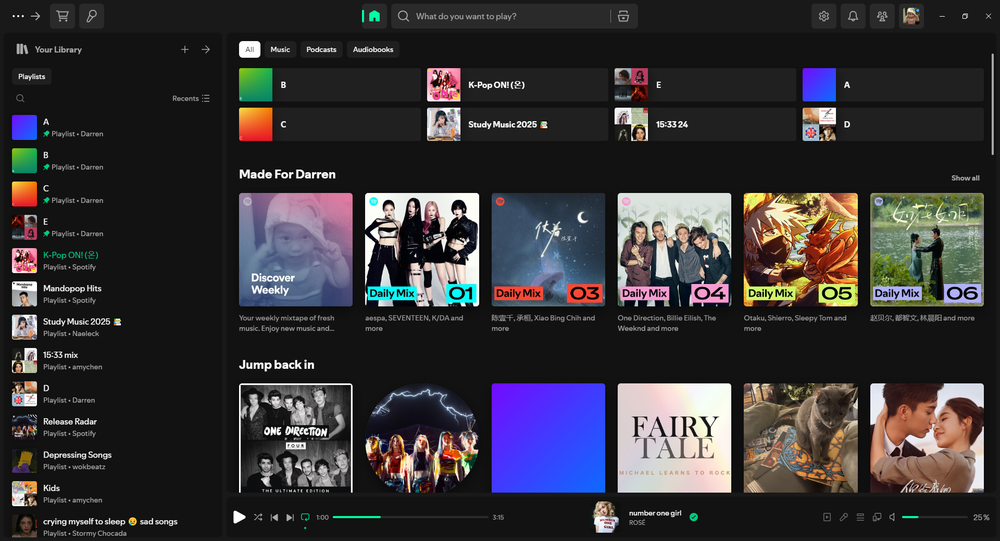
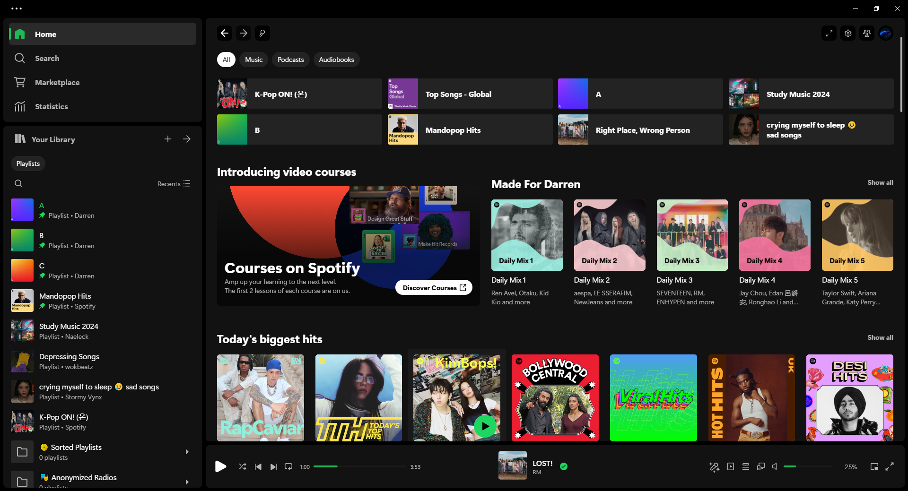
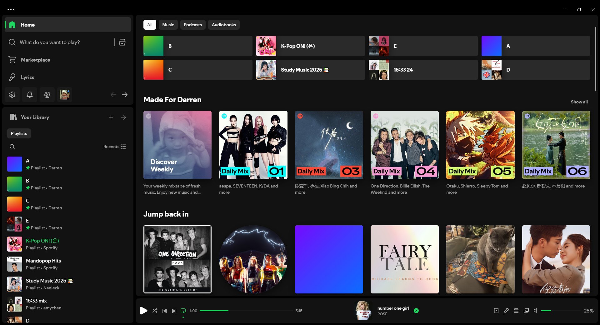
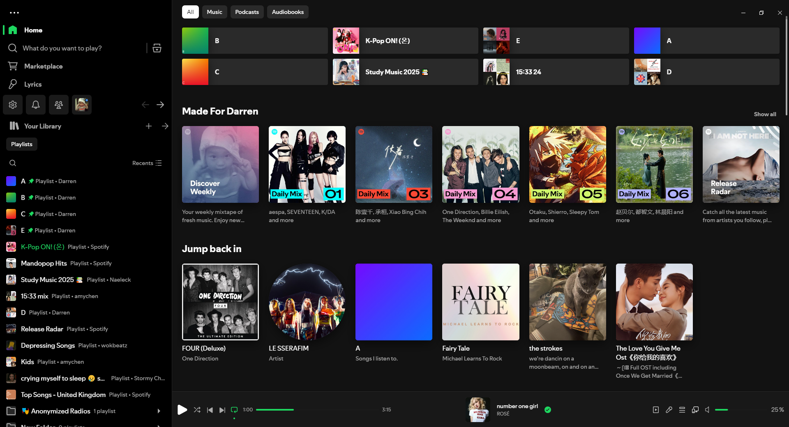
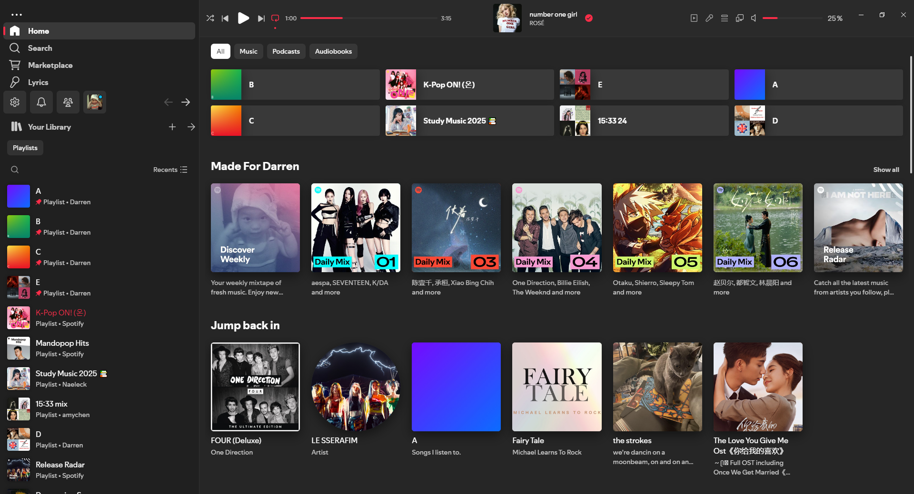

# Spicetify Theme

A customisable Spicetify theme inspired by Fluent UI and Apple Music

<a href="https://github.com/veryboringhwl/spicetify/blob/main/README.md#Preview">Preview</a> | <a href="https://github.com/veryboringhwl/spicetify/blob/main/README.md#IInstallation">Installation</a> | <a href="https://github.com/veryboringhwl/spicetify/blob/main/README.md#Uninstallation">Uninstallation</a> | <a href="https://github.com/veryboringhwl/spicetify/blob/main/README.md#Colour-scheme">Colour Scheme</a> | <a href="https://github.com/veryboringhwl/spicetify/blob/main/README.md#Features">Features</a>

The latest version of this Spicetify theme has been tested on these versions of Spotify:

## Supported Versions

| Versions     | Date             |
| ------------ | ---------------- |
| `1.2.50.335` | 19 December 2024 |
| `1.2.51.345` | 19 December 2024 |
| `1.2.52.442` | 06 January 2024  |

## Preview

| Color       | Screenshot                       |
| ----------- | -------------------------------- |
| **Dark**    |        |
| **Light**   |      |
| **Bloom**   |      |
| **Spotify** |  |

## Installation

### Automatic Installation

Windows → PowerShell/Terminal:

```pwsh
iwr -useb https://raw.githubusercontent.com/veryboringhwl/spicetify/main/install.ps1 | iex
```

Linux and MacOS → Bash/Terminal:

```sh
curl -fsSL https://raw.githubusercontent.com/veryboringhwl/spicetify/main/install.sh | sh
```

### Manual Installation

1. Clone or download the repository
2. Navigate to your Spicetify folder (Type `spicetify config-dir` in terminal)
3. Move the entire `dist` folder into `themes`
4. Rename the `dist` folder to `boring`
5. Open Terminal and run these commands to apply:

```
spicetify config current_theme boring
spicetify config inject_css 1 replace_colors 1 overwrite_assets 1 inject_theme_js 1
spicetify apply
```

## Uninstallation

Type these commands into the terminal:

```
spicetify config color_scheme ''
spicetify config current_theme marketplace
spicetify apply
```

## Colour Scheme

### For manual install only

The available colour schemes are `dark`, `light`, `bloom`, and `spotify`. Apply by typing into terminal (remove the `< >` when typing):

```this is supposed to be terminal(windows or macos)
spicetify config color_scheme <colour scheme>
```

## Features

| Feature                | Description                                | Screenshot                             |
| ---------------------- | ------------------------------------------ | -------------------------------------- |
| **Settings Menu**      | Easily customise theme settings            | N/A                                    |
| **Dynamic Background** | Background adapts to current track artwork | N/A                                    |
| **Colour Schemes**     | Four distinct themes                       | N/A                                    |
| **Custom Snippets**    | Modify layouts with built-in CSS snippets  | N/A                                    |
| **LibX Layout**        | Restores UI to ~2023/24 layout             |              |
| **PreLibX Layout**     | Restores UI to ~2022 layout                |        |
| **Apple Music Layout** | Interface styled similar to Apple Music    |  |
| **Lyrics Background**  | Dynamic background effects for lyrics page | N/A                                    |

## Credits

Based on:

- [Bloom](https://github.com/nimsandu/spicetify-bloom)
- [Comfy](https://github.com/Comfy-Themes/Spicetify)
- [Hazy](https://github.com/Astromations/Hazy)
- [Apple Music](https://music.apple.com/gb/new)

<!--
## TODO
- Update install scripts
- Add missing features images
- Add all features to table
  -->
