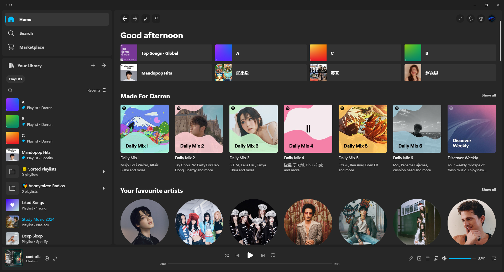
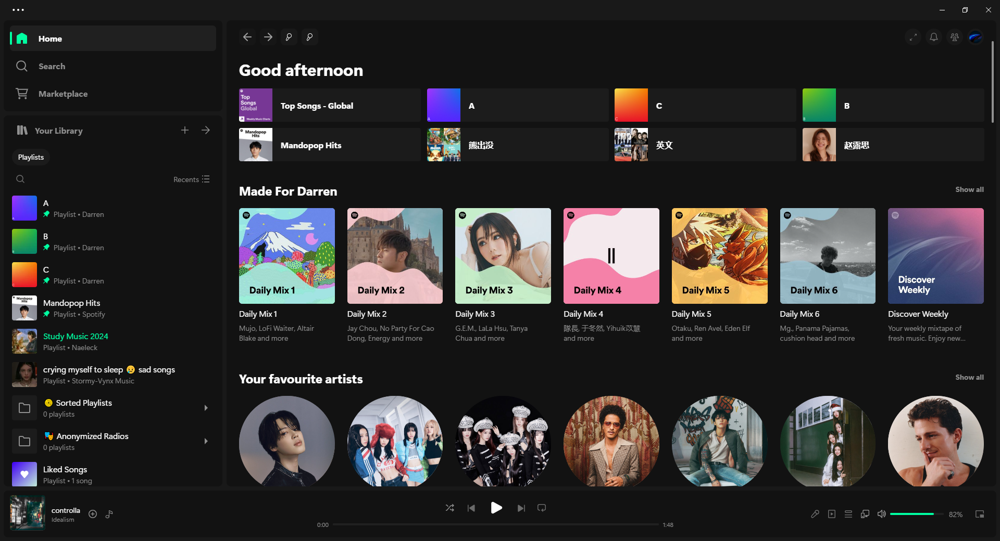
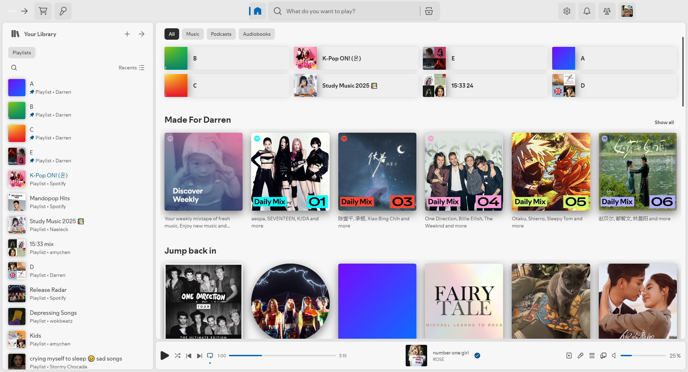

<div align = "center">
<h1>Boring theme</h1>
<p>Boring theme inspired by Bloom and Fluent</p>
</div>

## Preview

### Fluent



### Dark



### Light


## Installation

### Auto Installation
Windows → PowerShell:

```powershell
iwr -useb https://raw.githubusercontent.com/veryboringhwl/spicetify-theme/main/install.ps1 | iex
```

Linux and MacOS → Bash:
```bash
curl -fsSL https://raw.githubusercontent.com/veryboringhwl/spicetify-theme/main/install.sh | sh
```
### Manual installation
1. Clone the repo
2. Navigate to ```%appdata%\spicetify\themes```
3. Move `src` folder into `themes`
4. Rename `src` to `boring`
4. Open Powershell and run these commands to apply

```powershell
 spicetify config current_theme "boring"
 spicetify config inject_css 1 replace_colors 1 overwrite_assets 1 inject_theme_js 1
 spicetify apply
```

### Uninstallation

```powershell
spicetify config color_scheme ''
spicetify config current_theme marketplace
spicetify apply
```

## Colour scheme
### (Manual install only)
The colour schemes are `dark` `fluent` `light`. Apply using 

```spicetify config color_scheme <colour scheme>```

## Credits
Based off of
- Bloom
- Fluent
