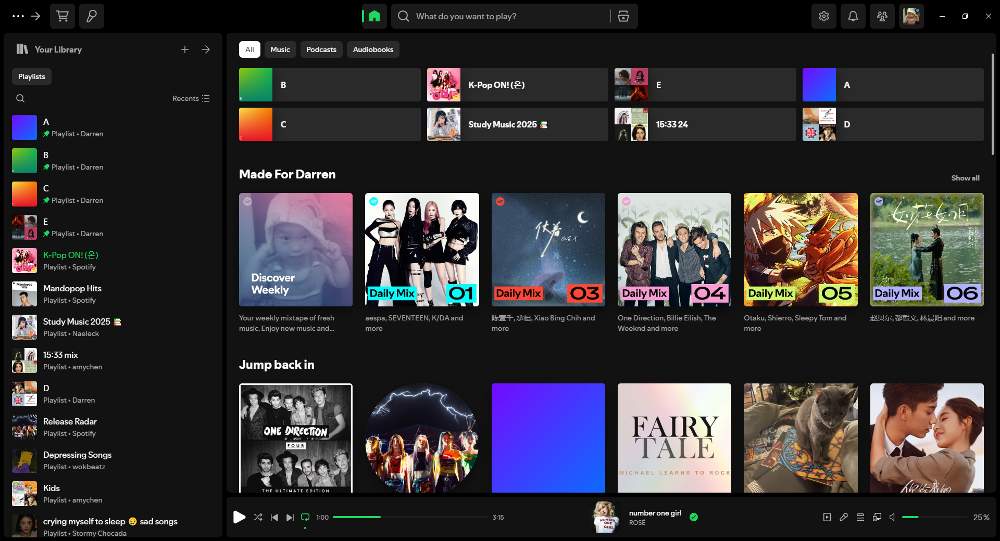

<div>
<h1>Spicetify theme</h1>
<p>Spicetify theme inspired by Bloom and Comfy</p>
</div>

## Preview

| Color                 |  Screenshot                           |
|-----------------------|---------------------------------------|
| Dark                  |            |
| Light                 |           |
| Bloom Dark            |       |
| Spotify               |         |

## Installation

### Auto Installation
Windows → PowerShell:

```powershell
iwr -useb https://raw.githubusercontent.com/veryboringhwl/spicetify/main/install.ps1 | iex
```

Linux and MacOS → Bash:
```bash
curl -fsSL https://raw.githubusercontent.com/veryboringhwl/spicetify/main/install.sh | sh
```

### Manual installation
1. Clone or download the repository
2. Navigate to your spicetify folder (Type `spicetify config-dir` into terminal)
3. Move the whole `src` folder into `themes`
4. Rename the `src` folder to `boring`
4. Open Powershell and run these commands to apply
```powershell
 spicetify config current_theme "boring"
 spicetify config inject_css 1 replace_colors 1 overwrite_assets 1 inject_theme_js 1
 spicetify apply
```

### Uninstallation
Type these commands into the terminal
```powershell
spicetify config color_scheme ''
spicetify config current_theme marketplace
spicetify apply
```

## Colour scheme
The colour schemes are `dark` `light` `bloomdark` `spotify`. Apply by typing into terminal (remove the < > when typing)

```spicetify config color_scheme <colour scheme>```

## Credits
Based off of
- Bloom
- Comfy